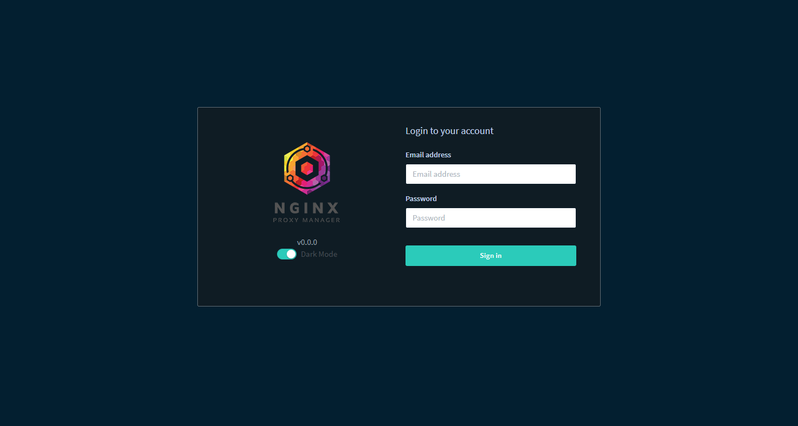

Update history
==
### 01/31/21
- rewrite readme
### 01/30/21
- first upate


What is this
==
Dark Theme for [nginx-proxy-manager (npm)](https://github.com/jc21/nginx-proxy-manager)

How to build
==
## Using Docker (Recommend)
```
$ git clone https://github.com/bsangmin/nginx-proxy-manager.git
$ cd nginx-proxy-manager/scripts
$ ./frontend-build
```
## Manual
```
$ git clone https://github.com/bsangmin/nginx-proxy-manager.git
$ cd nginx-proxy-manager/frontend
$ npm install (or yarn install)
$ npm build (or yarn build)
```
Install
== 
```
You can see dist in frontend directory after build source
and make container with -v option or copy to using path of frontend
ex) -v /path/your/dist:/app/frontend
```

Sample
==



Color set
==
### Color set is in [Docker document night mode](https://docs.docker.com/)

